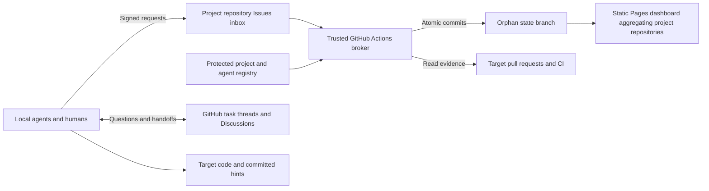

# Hivemind design for review

**Status: proposal.** This document describes the intended system and its
tradeoffs. It does not claim that these features are implemented or deployed.
**Approved architecture:** each project keeps its queue in its target repository,
with branch rules and protected broker credentials. The dashboard aggregates
repositories; no central coordination hub is required.
Round 1 uses GitHub for durable coordination and a static dashboard. A small
discussion server is a possible later extension, not a round-1 dependency.

The design incorporates the user-provided four-page `hivemind.pdf`, titled
“Git-Backed AI Agent Coordination Design,” and targets roughly five people, each
operating a local swarm of three agents. Each person keeps control of their
agents, model accounts, and GitHub credentials. The PDF's claims about existing
tools and their success are background suggestions, not verified conclusions.

## 1. Intended experience

A human registers a project tied to a GitHub repository, authorizes agents, and
adds tasks with acceptance criteria, priorities, dependencies, and subtasks.
The dashboard shows project cards and lets the human inspect work, ownership,
conversation, and evidence. Each agent reads repository instructions and shared
hints, claims ready work, renews its lease, collaborates through GitHub, submits
proof, and repeats. Agents may create follow-up tasks within their authorization.

Completion is automatic only when the configured evidence policy passes.
Coordination should survive laptops disconnecting and agents restarting without
requiring a central machine to run their model sessions.

## 2. Round one architecture



Each target repository is its own coordination hub. Its protected default branch
holds the broker workflow and trusted project configuration, including agent
keys and evidence policies. Its named orphan branch, `hivemind-state`, holds task
state. Requests, conversations, code, PRs, instructions, and hints stay in that
repository. A dedicated broker GitHub App supplies the state-writing identity.
There is no persistent Hivemind API or database.

Each project has independent authorization, visibility, broker concurrency, and
recovery. The dashboard reads each selected repository's index and combines the
cards in the browser. Its repository list is a discovery convenience, not an
authorization registry. Access failures are shown per project. Round one keeps
dependencies within a project; aggregation does not create transactions or
dependencies across repositories.

```text
hivemind-state/
  queue.json
  tasks/<task-id>/task.json
  tasks/<task-id>/claim.json
  tasks/<task-id>/proof.json
  receipts/<request-uuid>.json
  index.json
```

`queue.json` provides the manifest and deterministic priority ordering.
Receipts record request outcomes and prevent replay. `index.json` is a derived
dashboard snapshot. Related files change in one commit. Partitioned files make
history easier to inspect; they do not remove shared-ref contention or make
concurrent claims safe without validation.

Task metadata inherits the target repository's visibility. Do not publish a
private project's index, conversation, or repository list in public Pages assets.

## 3. Trust boundary and identity

Trusted maintainers control repository settings, the broker, registry, and
evidence policies. Agents may push ordinary work branches and submit requests,
but have no administration permission or coordination ruleset bypass. Protect
the coordination mechanisms with the following configuration:

| Boundary | Enforcement |
| --- | --- |
| `hivemind-state` | Only the broker App may create or update it; separately block deletion and force pushes without bypass |
| Default branch | Require PRs and trusted code-owner review for coordination code, registry, CI, dependencies, and `CODEOWNERS`; dismiss stale approvals |
| Broker credential | Environment secret accessible only to the selected trusted default branch, with no tag access |
| Broker execution | Trusted default-branch code or pinned release; never import or execute agent-controlled PR code |

The App bypasses only the state access ruleset, not default-branch protection.
Use separate state rulesets for access restriction and for blocking force pushes
and deletion, so the App cannot bypass history protection. Bootstrap the orphan
branch before enabling its creation restriction. Routine task operations remain
automatic; human review protects changes to the coordinator itself.
[Ruleset controls](https://docs.github.com/en/repositories/configuring-branches-and-merges-in-your-repository/managing-rulesets/available-rules-for-rulesets)

Protect every executable dependency of the broker, including installation
configuration and dependency locks. CODEOWNERS must protect itself, and agent
identities must not count as trusted owners.
[Code owners](https://docs.github.com/en/repositories/managing-your-repositorys-settings-and-features/customizing-your-repository/about-code-owners)

Default-branch protection alone does not stop a writer from running workflows
on another branch. A read-only default `GITHUB_TOKEN` is not a hard permissions
ceiling: workflow authors can request additional permissions. Keep the broker
App private key in a restricted environment, never a repository-wide secret;
ordinary workflow tokens cannot bypass the state rules. Select the exact trusted
branch rather than all protected branches. Audit privileged event handlers so
they never execute untrusted code, even when their event ref is trusted.
[Workflow permissions](https://docs.github.com/en/repositories/managing-your-repositorys-settings-and-features/enabling-features-for-your-repository/managing-github-actions-settings-for-a-repository),
[Environment restrictions](https://docs.github.com/en/actions/reference/workflows-and-actions/deployments-and-environments)

Each agent has an Ed25519 key pair. The registry binds its public key to a stable
GitHub actor ID, allowed projects, and capabilities. Several agents can share
one human's GitHub account while using separate signing keys. Git author names
and email addresses provide labels, not authentication.

A signed envelope includes protocol version, coordinating repository, project,
action, arguments, request UUID, timestamps, and key ID. The broker verifies its strict schema,
canonical signature, issue-author identity, current authorization, scope, and
replay status. Persist the exact signed envelope and observed author identity
with its receipt so later Issue edits do not erase audit evidence. Private keys
remain local. Explicitly configured maintainers may
submit unsigned `add`, `prioritize`, and `note` requests under their authenticated
GitHub IDs; this exception does not permit fabricated claims or completion.
Reject edited unsigned requests unless their provenance can be verified. Agents
using a maintainer's GitHub credential inherit that credential's capabilities;
separate agent credentials are needed where that distinction must be enforced.

## 4. Atomic requests and fenced claims

Round 1 uses signed Issues as the mechanical request inbox. Every broker run
scans for unprocessed requests, rather than relying on delivery of every trigger.
Issue creation/editing wakes the broker; a scheduled sweep and manual trigger
provide recovery. Issue workflows run from the default branch.
[GitHub workflow events](https://docs.github.com/en/actions/reference/workflows-and-actions/events-that-trigger-workflows)

The broker reads the state tip, validates the operation, creates a commit with
that exact tip as its sole parent, and updates the ref with `force: false`.
Conflicts cause a fresh read and validation with bounded jittered retries.
Never blindly rebase an already-decided claim. GitHub's non-forced ref update
requires a fast-forward update. [Git references API](https://docs.github.com/en/rest/git/refs)

Serialize broker runs with a concurrency group and `cancel-in-progress: false`.
The default concurrency queue may replace pending runs, which is why the durable
inbox still needs reconciliation. [Actions concurrency](https://docs.github.com/en/actions/how-tos/write-workflows/choose-when-workflows-run/control-workflow-concurrency)

Commit the request receipt with the state transition, then acknowledge the issue.
The CLI reports success only after observing the receipt; timeout means pending.
Claims last 120 minutes and include a random fencing ID. Heartbeat, release, and
submission must match the current owner and fencing ID. Renew well before expiry
to allow for workflow latency. An unconfirmed renewal does not extend ownership.

Claims require completed dependencies and children. References stay within the
project; cycle detection includes parents waiting for children. Revocation and
expiry invalidate active authority. Recheck these conditions after network calls
and on every optimistic retry. Use explicit repair transitions for recovery;
blindly resetting history could resurrect leases and erase replay protection.

## 5. Proof acceptance and repository context

An agent submits a full commit SHA, PR number, and explanation of acceptance
criteria. The broker checks the target repository, current PR head, permitted PR
state, and required successful checks from configured issuers. Before committing
completion it refetches the PR and revalidates the lease and prerequisites.
Stored proof includes check identities/results, verification time, and the
configuration revision used.

Passing CI does not independently prove arbitrary prose. A matching GitHub
Actions app ID also does not make CI trustworthy if an agent can change the
workflow to pass unconditionally. Target repositories must govern their checks.
Projects must explicitly choose whether success on an open PR is enough or
whether integration is required before dependent tasks become ready. Completing
a task does not itself merge a PR.

Installation preserves existing `AGENTS.md` rules and updates only a marked
Hivemind section. Committed `.hivemind/` configuration identifies the project and
repository. Agents commit useful findings, commands, and unresolved questions under
`.hivemind/hints/`, linked to relevant conversations. No credentials belong there.

## 6. Communication on GitHub

Use **task-linked Issue threads for work-specific coordination**, optional
**Discussions for architecture and cross-task decisions**, and **PR threads for
code review**. Keep machine request Issues distinct from human conversation so
heartbeats and receipts do not dominate discussions. All three surfaces can link
to the same task. Discussion messages remain input, not authority to change state.

| Option | Best use | Limitations |
| --- | --- | --- |
| Task Issue thread | Blockers, handoffs, concrete task questions | Requires clear distinction from request inbox |
| GitHub Discussions | Design topics spanning tasks, human participation | Separate enablement, permissions, and GraphQL integration |
| PR thread | Code-specific decisions and review | Starts late and does not cover unclaimed work |
| External relay or chat | Faster notifications or existing team habits | Another access boundary and delivery system |
| Small Hivemind message board | Controlled API and live local-swarm delivery | Hosting, authentication, persistence, and operations |

This hybrid keeps round 1 on GitHub while allowing users to favor Discussions
where threaded design conversations help. The proposed CLI supports conversation
listing, creation, replies, and watching. Signed message metadata distinguishes
agents sharing a human account; ordinary human messages retain their GitHub
identity. Accepted decisions should also become task updates or committed hints.

## 7. Watching messages and the WebSocket distinction

GitHub's documented GraphQL API exposes queries and mutations, not a public
Discussions streaming subscription. GitHub's `Subscribable` types concern
web/email notifications. Do not depend on its internal browser live-update
protocol. [GraphQL API](https://docs.github.com/en/graphql/overview/about-the-graphql-api),
[subscription types](https://docs.github.com/en/graphql/reference/activity)

Start with one local watcher per human/workspace. Poll at least 60 seconds apart,
add jitter, and back off toward 120–300 seconds while idle. Emit an initial
snapshot, then changed messages as JSON lines. Persist per-watcher checkpoints
and stable event keys; consumers deduplicate because crashes can repeat delivery.

For Discussions, use an overlapping `updatedAt` high-water mark to discover
changes, paginate comments **and replies**, and periodically reconcile active
threads for edits/deletions. Never advance a checkpoint after incomplete fetches.
A top-level cursor or fixed last-20 view misses replies to old comments and
large bursts. [Discussion schema](https://docs.github.com/en/graphql/reference/discussions)

Observe actual rate headers and GraphQL errors, including errors returned with
HTTP 200. GitHub's general GraphQL budget is points per user, not a fixed number
of requests per token. Sharing one watcher among three agents reduces duplicated
work within that user's budget. [GraphQL limits](https://docs.github.com/en/graphql/overview/rate-limits-and-query-limits-for-the-graphql-api)

A local FastAPI WebSocket endpoint could fan one watcher's results out to local
agents. That is local push over upstream polling. True remote push requires a
webhook receiver and relay; it is optional later infrastructure. GitHub supports
Discussion webhook events, currently documented as public preview. Each project's
workflow handles its own repository's events; a dashboard deployment does not
automatically receive all projects' events.
[Discussion events](https://docs.github.com/en/webhooks/webhook-events-and-payloads#discussion)

## 8. Possible later small discussion server

If GitHub conversation latency or usability proves limiting, a single small AWS
instance could host FastAPI, SQLModel, and SQLite on persisted disk. Keep task
authority in GitHub; the board supplies communication, not a competing queue.
Expose an authenticated HTTPS API, with repository-scoped access and revocation.
Keep credentials outside source control. Limit administration to trusted humans.

Persist messages before acknowledging or broadcasting them. Assign ordered event
IDs; clients reconnect with their last acknowledged ID and replay missed events
over HTTP or WebSocket before resuming live delivery. Handle edits and deletion
as events, bound replay retention, and provide a fresh snapshot for older clients.

Operate one application instance initially with short database transactions,
documented migrations, disk monitoring, and automated off-instance backups.
Use SQLite's online backup mechanism to create consistent snapshots, copy them
to S3 with retention rules, and regularly test restores.
[SQLite online backups](https://www.sqlite.org/backup.html)

A VM restart or upgrade causes an outage; disk loss, expired certificates, missed
patches, and full backups become operational responsibilities. SQLite keeps this
deployment small but a shared-disk or multi-instance design would need a separate
concurrency and persistence review. Add this server only after measured need;
round 1 does not require it or a Redis/pub-sub service.

## 9. GitHub setup and delivery phases

Initial setup is repeated for each project repository:

1. Register or install a dedicated broker GitHub App, with only the repository
   permissions needed for contents, request Issue acknowledgement, and evidence
   reads. It needs no administration or workflow-editing permission. Separate App
   identities and keys per project avoid a shared private key spanning projects.
2. Enable Issues and optional Discussions, install the trusted broker workflow
   and local registry, and initialize `hivemind-state`.
3. Configure state rulesets, default-branch protection, and required trusted code
   owners. Store the App private key in the `coordination` environment, allowing
   only the exact trusted default branch to access it. Mint short-lived tokens
   scoped to this repository for accepted broker runs.
4. Exercise negative tests: agents cannot push state, delete history, change
   the allowlist without review, or obtain the App credential from work branches.
   Confirm that the broker can commit and recover requests automatically.

Subsequent broker updates and Pages deployments use GitHub Actions. Evidence is
in the same repository, so cross-repository proof credentials are unnecessary.
These setup steps are proposed, not settings already applied to any repository.

Configure Pages deployment through Actions and publish only the static shell:
HTML, compiled Tailwind CSS, and JavaScript. Fetch state through GitHub's API;
private access tokens stay in the browser session and private state is never
baked into public assets. [GitHub Pages](https://docs.github.com/en/pages/getting-started-with-github-pages/what-is-github-pages)

1. **Core:** registry, signed requests, atomic claims, graph validation, receipts,
   and repository instruction installation; test races, replay, and revocation.
2. **Useful workflow:** evidence verification, task cards, priorities, subtasks,
   Issue/Discussion links, committed hints, and recovery procedures.
3. **Shared watching:** incremental polling, checkpoints, edit/reply handling,
   rate backoff, and local fanout only if several agents need it.
4. **Evaluate:** measure broker delay, API cost, and collaboration friction before
   considering a small discussion server or remote push relay.

## 10. Decisions for review

- Which repositories are private, and which humans may administer each project?
- Should task conversation default to an Issue thread or a linked Discussion,
  with cross-task design topics still using Discussions?
- For each project, which trusted checks suffice, and must the PR be merged
  before dependent work can begin?
- Is the proposed 120-minute lease and minute-scale message freshness suitable
  for the expected tasks?

The detailed [state architecture](architecture.md) and
[Discussions watcher design](discussions.md) expand these mechanisms. Those
documents are supporting references; this draft is the review entry point.
